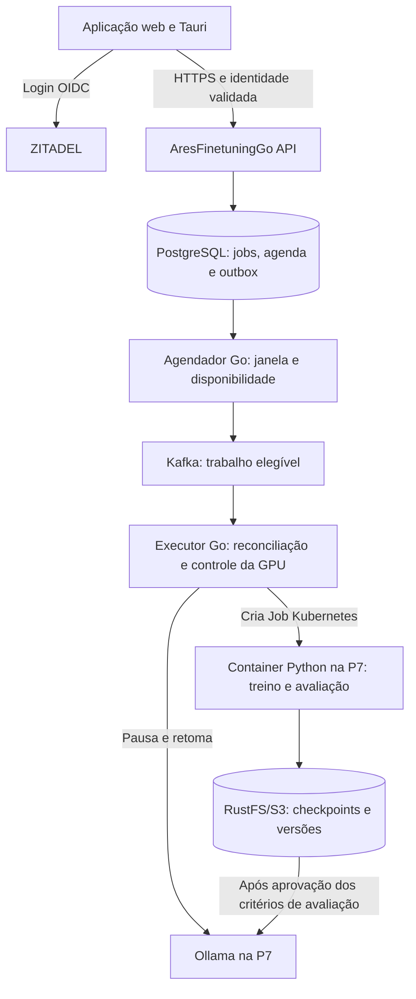

# IA própria e fine-tuning na P7

> Histórico de avaliação. A decisão posterior adota Angular + .NET + Python. Consulte [arquitetura atual](platform.md). As referências a Go/Svelte abaixo descrevem a proposta anterior.

Data da avaliação: 25/09/2026. Estado: proposta baseada em código, documentação, consultas somente de leitura ao cluster/P7 e documentação oficial. Nenhum treinamento, download de modelo, alteração de configuração ou deploy foi executado nesta avaliação.

## Decisões e recomendação

O usuário definiu ZITADEL para identidade e autorizou, como desenho da solução, janelas de treinamento com pausa temporária da inferência e uso do Kafka existente. Também definiu o reaproveitamento de PostgreSQL, Redis, MongoDB e Qdrant, aplicações de CPU na H6 e observabilidade integrada ao Grafana. Para embeddings, priorizar Google AI Studio/Gemini com credenciais do Infisical; os modelos da P7 ficam como último recurso. O CI/CD deve seguir `site-persike-svelte`, com GitHub Actions. Os horários concretos ainda não foram definidos.

Recomendação: `AresFinetuningGo` gerencia solicitações, permissões, agenda e estado; um executor Go consome Kafka e cria Jobs do Kubernetes; o projeto `estudos-finetuning-py`, empacotado em imagem CUDA, executa o treino na GPU da P7. O Ollama continua como serviço de inferência. O repositório `infra-k8s` controla a configuração declarativa dos serviços, permissões, armazenamento e políticas.

O código Python é desenvolvido e versionado em seu repositório, construído em uma imagem e executado em um pod na P7. Não precisa de checkout manual na VM, servidor HTTP Python permanente ou comando SSH disparado pela API.

Hexagonal e orientação a eventos são aspectos da mesma solução: as portas/adaptadores organizam o código de cada serviço; comandos/eventos Kafka conectam processos assíncronos. Não haverá um repositório por padrão arquitetural. O AresFinetuningGo pode conter API e executor em executáveis/Deployments separados, compartilhando domínio e casos de uso. DDD orienta os conceitos e regras; a separação domínio/aplicação é compatível com Clean Architecture. O Python permanece em seu projeto e imagem próprios.

## Estado observado

| Item | Evidência em 25/09/2026 | Implicação |
|---|---|---|
| Cluster | Sete nós Ready, Kubernetes v1.32.13 | Usar o cluster existente |
| P7 | Nó `p7`, 6 vCPU, RTX 3060 com 12.288 MiB de VRAM | Um treinamento por vez, GPU exclusiva |
| Memória da VM | `free` informou cerca de 18,6 GiB; em consulta posterior o kubelet reportou cerca de 17,2 GiB de capacidade e 13,0 GiB alocáveis | Memória varia com ballooning; não dimensionar como se 24 GiB estivessem garantidos |
| Disco de dados | `/srv/data`: cerca de 590 GiB, 565 GiB disponíveis | Separar cache de pesos, checkpoints e artefatos; monitorar ocupação |
| Ollama | Deployment `ai/ollama` Running na P7, imagem 0.33.2; reserva `nvidia.com/gpu: 1` | Mesmo sem modelo carregado, o pod mantém a reserva Kubernetes da GPU |
| Kafka | `dados/kafka-0` Running no flex3a | Reaproveitar broker existente |
| ZITADEL | Core e Login UI Running; discovery OIDC respondeu com issuer `https://auth.victorpersike.dev.br` | Infra do IdP está acessível; clientes, roles e login da aplicação ainda precisam de integração |
| Argo CD | Componentes Running | Coordenar a gestão de réplicas do Ollama com o controlador de janelas, caso o Deployment seja sincronizado pelo Argo |
| Dados | PostgreSQL, Redis, MongoDB, Qdrant e Kafka observados Running no flex3a; RustFS no flex4a | Reutilizar os serviços, com bancos/buckets e permissões da aplicação |
| H6 | 4 CPUs e aproximadamente 15 GiB de RAM alocáveis pelo kubelet | Capacidade total alocável, não recursos livres; dimensionar requests das aplicações antes do deploy |
| Observabilidade | Grafana, Prometheus, Loki e Jaeger Running na H5 | Integrar aplicações ao stack existente; funcionamento ponta a ponta ainda precisa de validação |

Documentação do hardware: [P7.md](../../../infra-k8s/clusters/flex/P7.md). Configuração do Ollama: [deployment.yaml](../../../infra-k8s/clusters/flex/platform/ollama/deployment.yaml). Algumas páginas de infraestrutura descrevem apenas a preparação, enquanto as consultas ao cluster mostram serviços já executando; distinguir documentação de estado observado.

## Fluxo proposto



As setas representam responsabilidades propostas. A publicação de artefatos no Ollama é uma etapa controlada pelo executor, com transporte/importação a implementar; não é integração automática do S3 com Ollama. O consumo normal de chat/RAG passa pelas APIs Go até o Service interno do Ollama.

1. O usuário autentica no ZITADEL, escolhe dataset, modelo e janela permitida.
2. A API valida identidade, acesso ao dataset, limites do perfil de treinamento e versão do modelo. Grava job, configuração e agendamento no PostgreSQL.
3. Quando o job estiver elegível, o agendador registra um evento em uma outbox transacional; um publicador o entrega ao Kafka. Uma única reserva ativa da P7 impede despachar diversos treinos simultâneos.
4. O executor verifica novamente janela, cancelamento e reserva, drena as requisições de inferência em andamento, reduz o Ollama a zero réplicas e aguarda a liberação efetiva da GPU.
5. O executor cria um Job com nome determinístico por `job_id` e tentativa. O container Python lê configuração e dataset versionados, executa treinamento, registra progresso e salva checkpoints.
6. Ao concluir, valida o modelo em dados separados do treino, salva métricas, adaptador e tokenizer e executa exportação quando couber na janela. A exportação também precisa de orçamento de RAM, disco e eventualmente GPU.
7. Publica uma nova versão somente após satisfazer os critérios de avaliação e completar upload/verificação dos artefatos. O original fica disponível para rollback.
8. Sem próximo trabalho admitido na janela, restaura o Ollama, verifica readiness e uma inferência de teste e libera o modo de manutenção. Falhas acionam reconciliação do mesmo estado; a restauração não depende apenas de um `defer` no processo Go.

Durante o treinamento, chat e operações RAG que dependem do Ollama ficam indisponíveis. Login, histórico, consulta de progresso, upload, extração/OCR em CPU e embeddings externos Gemini podem continuar nos nós de CPU. A interface deve mostrar a janela e a previsão de retomada. Não manter conexões de chat esperando horas.

## Kafka e horários

O broker atual está em `kafka.dados.svc.cluster.local:9092`, com um único broker/controller, uma partição padrão, criação automática de tópicos desativada e retenção padrão de **24 horas ou 512 MiB por partição**. A política de rede exige o label `kafka-client: "true"` nos pods clientes. Fonte: [README do Kafka](../../../infra-k8s/clusters/flex/dados/kafka/README.md).

Kafka transporta eventos; o agendador da aplicação decide quando um trabalho pode executar. Para um treino marcado para daqui a vários dias, o registro permanece no PostgreSQL e só vira evento de execução quando elegível. Assim, a retenção do Kafka não apaga a agenda. Não colocar um `sleep` de horas no consumidor nem usar Kafka como único histórico do treinamento.

Tópicos propostos, a criar explicitamente pelo processo de infraestrutura:

| Tópico | Uso |
|---|---|
| `ares.finetuning.ready.v1` | Solicitação elegível, com `job_id`, tentativa, versão do schema e referência à configuração |
| `ares.finetuning.events.v1` | Mudanças de estado e progresso agregado; não enviar cada token/log |
| `ares.finetuning.dlq.v1` | Eventos inválidos ou falhas de processamento esgotadas, com diagnóstico |

Uma partição de execução e um consumer group são suficientes inicialmente para uma P7. Ainda é necessário um controle de exclusão da GPU: um único consumidor pode criar vários Jobs antes de o primeiro terminar. A reserva persistente, protegida por transação/lease e reconciliada com o cluster, limita o total ativo a um. Expiração de lease não autoriza outra execução sem verificar o Job existente.

A entrega deve tolerar repetição: outbox, identificador estável, criação idempotente do Job, estado oficial no banco e tratamento de eventos duplicados. O offset pode ser confirmado após persistir a execução e confirmar a criação, ou existência, do Job esperado. Não deixar uma mensagem sem tratamento por toda a duração de um treino de horas; o executor acompanha o Job separadamente. Falha entre banco, Kubernetes e Kafka deve ser recuperada por reconciliação. Essas garantias são de aplicação; transações Kafka sozinhas não tornam a criação de um Job Kubernetes exatamente uma vez. Referência: [semântica de entrega do Apache Kafka](https://kafka.apache.org/41/design/design/).

Definir janelas em `America/Sao_Paulo` e armazenar instantes em UTC, com `not_before`, prioridade, duração máxima, tentativa e checkpoint de retomada. Por exemplo, uma janela noturna pode admitir vários treinos curtos em sequência. O horário exato é configuração a definir com o usuário, não uma decisão já aplicada.

Antes de admitir um treino, reservar tempo para carregar pesos, treinar, salvar e restaurar inferência. Ao aproximar-se do fechamento, parar novas admissões e solicitar checkpoint. Retomar na próxima janela exige suporte explícito de save/resume no Python, inclusive estado do otimizador. Sem esse suporte validado, admitir somente jobs com duração limitada que caibam na janela; não prometer pausa/retomada transparente. Um timeout forçado deve ser registrado como falha, nunca como conclusão.

O Kafka atual é de desenvolvimento, sem alta disponibilidade e com transporte interno PLAINTEXT. Para o piloto interno, a fila proposta é pequena e compatível com esse desenho; uma queda do flex3a suspende o despacho. A outbox e a reconciliação preservam a possibilidade de reenviar trabalhos pendentes, mas não substituem backup do banco nem alta disponibilidade.

## Divisão entre projetos

| Projeto | Responsabilidade e adaptação |
|---|---|
| `workflows-ia-trainner` | Cliente web/Tauri, login ZITADEL, datasets, agenda, fila, progresso SSE, manutenção de inferência e resultados |
| `AresSharedGo` | Autenticação OIDC genérica, autorização e observabilidade comuns |
| `AresFinetuningGo` | Dono dos jobs de fine-tuning; API e executor/agendador em Deployments separados; substituir publisher RabbitMQ por Kafka; estado durável proposto em PostgreSQL |
| `TrainingServiceGo` | Reutilizar equipes, datasets, catálogo e rotas úteis; encaminhar operações de fine-tuning ao serviço responsável e eliminar a segunda fila/simulação desse fluxo |
| `AresChatGo` / `AresRagGo` | Histórico, ingestão, busca e acesso autenticado à inferência |
| `estudos-finetuning-py` | Implementação de treino, exportação, métricas e avaliação em imagem CUDA versionada |
| `infra-k8s` | Deployments, templates/políticas dos Jobs, ServiceAccounts/RBAC, PVCs, tópicos Kafka, secrets, rede e observabilidade |

O projeto Go atual já publica RabbitMQ, persiste jobs em Redis e contém uma função para subprocesso. Não foi encontrado consumidor que feche esse caminho. Para o desenho adotado, Kafka substitui RabbitMQ; o PostgreSQL passa a ser a fonte oficial proposta para agenda/estado/outbox. Redis pode continuar para progresso e cache. Essas são mudanças a implementar, não recursos já prontos.

O Python encontrado em `estudos-finetuning-py` já tem CLI `finetuning train`, LoRA/QLoRA, configuração por YAML, exportação GGUF e progresso `PROGRESS:{...}`. É uma base útil. Ainda precisa de imagem de execução, versões compatíveis fixadas, configuração por job, download/upload de artefatos, checkpoint/retomada validado e avaliação. O marcador de stdout é compatível com o parser de subprocesso do AresFinetuningGo, mas isso não conecta automaticamente o progresso de um pod remoto: implementar envio autenticado de progresso ou coleta por runner/controlador, com persistência.

O treino usa `FastModel`, mas a exportação usa `FastLanguageModel` e gera um template genérico. Adaptar carregamento, template de chat e EOS para cada família, principalmente nos modelos multimodais. Os presets atuais incluem Qwen2.5 e Gemma2, não as famílias Qwen3.5/Gemma4 da P7. `transformers>=4.57` no pacote não assegura a versão v5 exigida para Qwen3.5; selecionar e testar um conjunto compatível. O extra Unsloth precisa estar instalado na imagem.

## Modelos e capacidade da GPU

Inventário lido diretamente do container Ollama na P7:

| Modelo instalado | Tamanho informado pelo Ollama em disco | Uso recomendado agora |
|---|---:|---|
| `qwen3.5:9b` | 6,6 GB | Inferência com visão, inclusive leitura de imagens; não é o primeiro candidato a treino na GPU de 12 GB |
| `gemma4:12b-it-qat` | 7,2 GB | Inferência multimodal; treinamento precisa de perfil medido antes de admissão |
| `qwen3-embedding:0.6b` | 639 MB | Embeddings locais como último recurso; não faz OCR |
| `bge-m3:567m` | 1,2 GB | Embeddings locais como último recurso e comparação de recuperação; não faz OCR |

`ollama show` confirmou Gemma4 com 11,9B parâmetros e quantização Q4_0. Tamanho do arquivo quantizado não é pico de VRAM do treinamento. O pipeline deve buscar pesos treináveis da revisão correspondente em Hugging Face/Safetensors, produzir adaptadores e depois exportar/importar em formato suportado pelo Ollama. Preservar tokenizer, template e revisão da base. A importação tem restrições por arquitetura: validar o artefato final com a versão de Ollama instalada. Referência: [importação de modelos do Ollama](https://docs.ollama.com/import).

| Candidato ao treinamento | Estratégia inicial | Decisão para a P7 |
|---|---|---|
| **Qwen2.5 3B** | QLoRA 4 bits, texto, batch 1 | Primeiro piloto para aproveitar o preset já existente no Python; medir VRAM, RAM e qualidade |
| **Qwen3.5 2B** | LoRA bf16; referência Unsloth de cerca de 5 GB | Opção para evoluir a família já usada em inferência; exige novo preset e stack compatível |
| Qwen3.5 4B | LoRA bf16; referência de cerca de 10 GB | Segunda etapa, margem apertada; reduzir contexto e medir pico |
| Qwen2.5 7B | QLoRA 4 bits | Candidato posterior; aprovar somente após benchmark real de treino e exportação |
| Qwen3.5 9B instalado | LoRA bf16; referência de cerca de 22 GB | Fora da capacidade da GPU atual nesse perfil |
| Gemma4 12B instalado | Perfil de treino a selecionar e medir | Não homologar por caber na inferência; não há medição local que confirme treino em 12 GB |

Os valores de Qwen3.5 são referências publicadas, não medições nesta P7. A documentação também recomenda evitar QLoRA 4 bits nessa família por diferenças de quantização. Fonte: [guia de fine-tuning Qwen3.5](https://unsloth.ai/docs/models/qwen3.5/fine-tune). Para modelos mais tradicionais, os [mínimos gerais do Unsloth](https://unsloth.ai/docs/get-started/fine-tuning-for-beginners/unsloth-requirements) servem só como triagem: sequência, batch, arquitetura, otimizador e exportação alteram o pico.

Se a preferência for Gemma, o [guia Gemma4](https://unsloth.ai/docs/models/gemma-4/train) oferece variantes menores E2B/E4B e perfis de memória. Não é necessário acrescentar outra família ao primeiro piloto. Também não é necessário treinar embeddings só porque estão instalados: antes, medir a qualidade do RAG com os modelos existentes.

Configuração inicial proposta para o piloto: batch 1, sequência de 512–1024 tokens, LoRA rank 8–16, gradient checkpointing e acumulação de gradientes. O preset Qwen2.5 atual referencia checkpoints sem sufixo Instruct; se o objetivo for partir de um assistente já ajustado, selecionar explicitamente o checkpoint Instruct correspondente e adaptar o template. Medir uma execução curta, incluindo avaliação e exportação; somente então aumentar contexto/dataset. Não confundir checkpointing de ativações, usado para reduzir memória, com checkpoints de treinamento usados para retomada.

## Execução e armazenamento no Kubernetes

Jobs GPU devem usar `nodeSelector: kubernetes.io/hostname=p7`, `runtimeClassName: nvidia`, toleration `dedicated=ai:NoSchedule` e limite `nvidia.com/gpu: 1`, conforme o padrão já adotado pelo Ollama. Usar `restartPolicy: Never`, tentativas explícitas e timeout compatível com a janela. Remover Jobs antigos apenas depois de preservar logs, estado e artefatos. Referências: [GPU no Kubernetes](https://kubernetes.io/docs/tasks/manage-gpus/scheduling-gpus/) e [Jobs](https://kubernetes.io/docs/concepts/workloads/controllers/job/).

Um protótipo pode começar com request de 2 CPUs/8 GiB e limite de 4 CPUs/10 GiB para o perfil menor, sujeito à memória realmente disponível e benchmark. Não é uma capacidade certificada. Antes de treinos maiores, estabilizar a memória da VM e conferir a memória alocável após reservas do kubelet e dos pods de sistema. O agendamento por GPU não protege contra falta de RAM da VM.

APIs e executor ficam em nós de CPU; o executor recebe RBAC limitado para os Jobs e para o scale do Deployment Ollama necessário ao fluxo. O pod de treino não precisa de credenciais administrativas de Kubernetes. Validar o template de Job e permitir somente modelos, imagens e configurações aprovados. Incluir proprietário/equipe em jobs, datasets e artefatos; o código atual de fine-tuning ainda não oferece esse isolamento completo.

Usar PVCs locais separados na P7 para cache Hugging Face e área de trabalho, e RustFS/S3 para datasets versionados, checkpoints e resultados duráveis. Não montar o cache interno do Ollama como se fosse a base de treino. Credenciais ficam sob o mecanismo Infisical/Secrets existente; mensagens Kafka levam referências e IDs, não datasets, pesos ou tokens.

O Ollama fica em `http://ollama.ai.svc.cluster.local:11434`, acessado pelas APIs Go. O frontend acessa HTTPS autenticado. O registro de modelos é um passo explícito de publicação, com versão imutável e rollback; obter sucesso no processo Python não basta para marcar o modelo como publicado.

O controlador de janelas deve ser o único responsável pelas alterações temporárias de réplicas. Se Argo CD gerenciar o Ollama, configurar a coordenação de ownership/ignore de `/spec/replicas` com respeito à diferença durante sync, restrita a esse recurso; não permitir que uma sincronização restaure o Ollama durante o treino. Não habilitar time-slicing como solução automática: compartilhamento não oferece isolamento de memória entre inferência e treinamento. Fonte: [NVIDIA GPU sharing](https://docs.nvidia.com/datacenter/cloud-native/gpu-operator/24.9/gpu-sharing.html).

## ZITADEL

O issuer e JWKS foram confirmados pelo discovery público:

```text
issuer:   https://auth.victorpersike.dev.br
jwks_uri: https://auth.victorpersike.dev.br/oauth/v2/keys
```

Criar aplicações OIDC próprias para web e Tauri/mobile. Usar Authorization Code + PKCE nos clientes públicos; para o web com BFF SvelteKit, manter sessão no servidor e cookie apropriado. No Tauri, abrir o navegador do sistema, validar retorno e guardar tokens em armazenamento seguro da plataforma. Aproveitar login/cadastro/verificação do próprio ZITADEL. Referência: [tipos de aplicação ZITADEL](https://zitadel.com/docs/guides/manage/console/applications-overview).

`AresSharedGo/auth` ainda monta issuer como `/realms/<realm>`, usa endpoint de certificados Keycloak e interpreta `realm_access`. Trocar apenas `KEYCLOAK_URL` não resolve. Refatorar para issuer configurável, discovery/JWKS, audience obrigatória da API e mapeamento das claims ZITADEL. Para access tokens JWT, validar assinatura, algoritmo, expiração, issuer e audience. Se a configuração escolhida emitir access tokens opacos, usar introspecção; não tentar decodificá-los como JWT. Fonte: [introspecção ZITADEL](https://zitadel.com/docs/guides/integrate/token-introspection).

Identidade vem do ZITADEL; autorização sobre equipes, datasets e jobs continua no domínio da aplicação. Definir como organizações/roles do IdP correspondem às permissões internas. Se houver dados ligados aos antigos usuários Keycloak, planejar a associação das identidades por procedimento controlado: os `sub` dos dois provedores não são intercambiáveis automaticamente.

## Distribuição dos componentes e uso dos dados existentes

| Local | Componentes previstos |
|---|---|
| H6 | Frontend web/BFF, APIs Go, agendador/executor de controle, orquestração RAG e eventual API .NET de consumo |
| P7 | Jobs Python de treino/avaliação/exportação que exigem GPU e Ollama para inferência/visão, em períodos alternados; embeddings locais somente como último recurso; agentes de sistema/telemetria também precisam cobrir o nó |
| flex3a | PostgreSQL, Redis, MongoDB, Kafka e Qdrant existentes |
| flex4a | RustFS existente para arquivos e artefatos |
| H5 | Grafana, Prometheus, Loki e Jaeger existentes |
| Placement atual do IdP | ZITADEL, preservando o deployment de infraestrutura existente |

O Job Python é criado pelo executor via API Kubernetes e agendado na P7. O processo de controle fica na H6. A P7 também precisa hospedar o Ollama para utilizar a GPU na inferência; a proposta de dedicar esse nó ao trabalho de IA inclui ambos, com exclusão mútua conforme as janelas. Não há proposta de mover bancos para H6. Afinidade/seletores e requests/limits devem expressar essa distribuição, após conferir ocupação real da H6.

| Serviço existente | Responsabilidade proposta |
|---|---|
| PostgreSQL | Estado oficial de jobs/agenda/tentativas, outbox, permissões de domínio e metadados versionados de datasets/modelos |
| Redis | Cache, limites de requisição e distribuição temporária de progresso; estado recuperável a partir das fontes duráveis |
| MongoDB | Histórico e mensagens das conversas, aproveitando AresChatGo |
| Kafka | Comandos de trabalho elegível e eventos de integração; não armazenar pesos/datasets no payload |
| Qdrant | Índice de vetores e metadados de recuperação, com filtragem por equipe/workspace/documento |
| RustFS/S3 | Arquivos originais, datasets, checkpoints, adaptadores e versões exportadas |

Cada serviço de aplicação acessa as dependências de que precisa, com responsabilidade clara sobre seus dados. O compartilhamento da instalação PostgreSQL não exige compartilhar tabelas entre serviços: usar bancos/schemas e credenciais com escopo adequado. Histórico de chat fica no MongoDB, logs operacionais no Loki, e artefatos grandes no S3.

## Embeddings e RAG

Qdrant armazena e pesquisa vetores. O provedor Gemini gera os embeddings antes da inserção ou consulta. Os modelos `bge-m3:567m` e `qwen3-embedding:0.6b` da P7 ficam como último recurso. Fonte: [visão geral Qdrant](https://qdrant.tech/documentation/overview/).

Na ingestão proposta, o serviço RAG na H6 lê o documento do S3, extrai texto ou solicita OCR, divide o resultado, solicita embeddings pelo SDK oficial Google Gen AI e insere os pontos no Qdrant. Na consulta, gera o embedding da pergunta com o mesmo perfil do índice, busca trechos autorizados e envia pergunta/contexto ao modelo de chat. Publicar o estado indexado somente depois de confirmar os lotes persistidos.

No Go, usar `google.golang.org/genai`, backend Gemini API. Candidato ao piloto: `gemini-embedding-2`, inicialmente 768 dimensões, sujeito a teste com o corpus. Esse modelo recebe a instrução de tarefa no texto, sem `task_type`; usar formatação consistente para documentos e perguntas. Vários conteúdos numa mesma entrada podem formar um único vetor: preservar um embedding por trecho, com requisições separadas ou Batch API apropriada. Fontes: [SDKs oficiais](https://ai.google.dev/gemini-api/docs/libraries) e [embeddings Gemini](https://ai.google.dev/gemini-api/docs/embeddings).

Localização fornecida pelo usuário e metadados confirmados por CLI autenticada, sem registrar os valores:

- Infisical: `https://secrets.victorpersike.dev.br`.
- Projeto: `e545d2be-9468-4535-809c-d8b9e0584ce0`.
- Ambiente consultado: `dev`; pasta: `/embedding`.
- Nomes encontrados: `sdk-gemini-1` e `sdk-gemini-2`.

Mapear as chaves para variáveis privadas do backend por Secret Kubernetes sincronizado pelo operador Infisical. Não embutir no frontend, imagem, manifest Git ou argumentos de comando. Confirmar o slug/escopo da identidade do operador antes de criar o recurso de sincronização. A existência das chaves ainda não comprova acesso ao modelo, quota ou cobrança habilitada. Duas chaves podem compartilhar a mesma quota de projeto; não planejar rotação como forma de contornar limites.

Registrar provedor, modelo/revisão, dimensão e versão do processamento por índice. Ao trocar o espaço de embeddings, criar coleção separada e reindexar; dimensões iguais não tornam modelos diferentes compatíveis. O fallback para P7 exige índice local correspondente e GPU disponível. Sem isso, manter a ingestão pendente para nova tentativa e informar indisponibilidade na busca, sem consultar um índice Gemini com vetor local. A API aplica o escopo de acesso em consultas e exclusões. Qdrant permanece em CPU no flex3a.

A ingestão demorada pode usar Kafka; perguntas interativas usam HTTP/streaming. Durante treino na P7, embeddings Gemini e busca Qdrant podem continuar; respostas de chat e visão dependentes do Ollama aguardam a retomada.

**Estado do código:** `AresRagGo` ainda chama diretamente o cliente Ollama para gerar embeddings. Adaptador Gemini, persistência do perfil do índice, sincronização dos secrets e testes reais de recuperação continuam como itens de implementação. Não foi alterado o provedor em execução nem reindexado conteúdo nesta avaliação.

## Imagens, PDFs e OCR

`ollama show` confirmou capacidade `vision` nos dois modelos de chat instalados: `qwen3.5:9b` e `gemma4:12b-it-qat`. Eles podem receber imagens e transcrever ou interpretar seu conteúdo. Os dois modelos de embeddings locais geram vetores e não transcrevem imagens. Fontes: [Qwen3.5](https://ollama.com/library/qwen3.5), [Gemma4 12B](https://ollama.com/library/gemma4:12b-it-qat) e [entrada de imagens no Ollama](https://docs.ollama.com/capabilities/vision).

| Entrada | Processamento proposto |
|---|---|
| PDF digital com texto utilizável | Extrair texto diretamente na H6, preservando referência de página; não precisa de OCR |
| PDF escaneado sem camada de texto | Renderizar páginas e reconhecer o texto com OCR |
| PDF com páginas digitais e escaneadas | Decidir por página; avaliar também regiões com imagens que contenham texto |
| PDF já submetido a OCR | Aproveitar a camada de texto se estiver correta; refazer apenas quando necessário |
| Imagem/fotografia | OCR para transcrição; visão quando precisar interpretar tabelas, gráficos ou contexto visual |

Começar com `pdftotext` e OCRmyPDF/Tesseract em CPU na H6, em worker/container Kubernetes com idiomas necessários, incluindo português. Extrair o texto completo do PDF resultante: o arquivo sidecar do OCRmyPDF pode conter apenas o texto reconhecido nas páginas processadas, omitindo páginas que já tinham texto. Fonte: [OCRmyPDF cookbook](https://ocrmypdf.readthedocs.io/en/latest/cookbook.html).

Como recomendação, usar visão na P7 para páginas que a extração/OCR comum não resolver satisfatoriamente. No caminho Ollama, converter essas páginas em imagens e enviar em `images`; não passar os bytes do PDF como imagem. Processar páginas em lotes limitados, medindo VRAM/latência, e respeitar as janelas de treinamento. Não houve benchmark local de OCR que permita escolher o melhor dos dois modelos ou certificar a precisão em números, tabelas e manuscritos.

Fluxo textual proposto: **arquivo → extração/OCR → texto com páginas e origem → divisão em trechos → embeddings Gemini → Qdrant**. OCR produz texto; embeddings produzem vetores. Um modelo multimodal pode também gerar embeddings de imagens/PDFs diretamente, mas esse caminho não entrega por si só uma transcrição verificável e exige desenho próprio de recuperação e referências.

**Estado do código:** `AresRagGo/internal/pdf/parser.go` usa `pdftotext`; `Workspace.extractText` não faz OCR nem renderização por página. Se a extração falhar, lê o arquivo bruto como texto, o que deve ser corrigido para PDFs/imagens: binário não pode virar conteúdo indexado. Um PDF escaneado pode retornar texto vazio mesmo sem erro no subprocesso; isso precisa acionar processamento adicional. Há cliente de visão, mas ele não está conectado a esse fluxo de upload. A capacidade dos modelos não significa que o pipeline já esteja implementado.

## CI/CD pelo GitHub Actions

Referência examinada: `SITE - PERSIKE/site-persike-svelte/.github/workflows/deploy.yml` e `scripts/ci/publish-manifests.sh`. Nesse projeto, GitHub Actions valida, constrói e publica a imagem no Zot, atualiza uma branch `gitops` e aguarda a release; Argo CD aplica os manifests no cluster. Portanto, seguir a referência significa entrega disparada pelo Actions com reconciliação Kubernetes pelo Argo CD.

Adaptar o padrão para os repositórios da solução:

1. PR: dependências fixadas, verificações/testes da linguagem, build e validação Kustomize/scripts, sem credenciais de produção.
2. Merge na branch de entrega ou execução manual: construir imagem `linux/amd64` para H6/P7, com identificação imutável do commit e execução.
3. Publicar no Zot e confirmar o digest; atualizar apenas manifests pertencentes à aplicação. `infra-k8s` continua dono dos serviços compartilhados, namespaces, permissões e configuração Argo.
4. Argo CD sincroniza os manifests; Actions confirma versão/readiness e executa smoke tests antes de declarar sucesso.
5. Rollback seleciona digest anterior; chaves Gemini entram somente no runtime via Infisical. O workflow não inicia treinamento como efeito do deploy.

Não copiar literalmente nomes de imagem, domínio, caminhos ou credenciais do site. O frontend deste repositório usa SvelteKit/Tauri, enquanto o workflow encontrado ainda tenta compilar um projeto .NET inexistente. Corrigir também os erros conhecidos de `check`/build web antes de habilitar publicação. APIs Go precisam dos próprios testes/builds; a imagem Python precisa validar CUDA e compatibilidade do perfil de treinamento. A adoção dessa esteira está documentada, mas nenhum workflow de entrega ou deploy foi executado nesta avaliação.

## OpenTelemetry e Grafana

Padronizar a instrumentação de Go, Python e eventual .NET com OpenTelemetry. OpenTelemetry gera/coleta/exporta sinais; os backends armazenam os dados e o Grafana os apresenta. Fonte: [OpenTelemetry](https://opentelemetry.io/docs/what-is-opentelemetry/).

| Sinal | Caminho proposto com a infraestrutura existente |
|---|---|
| Traces | SDK OpenTelemetry → receptor/coletor OTLP → Jaeger → Grafana |
| Métricas | Instrumentação/exporters → Prometheus → Grafana |
| Logs | JSON estruturado com IDs de correlação → agente de coleta → Loki → Grafana |

As configurações versionadas de Grafana já incluem datasources Loki e Jaeger. Jaeger expõe OTLP gRPC em 4317 e HTTP em 4318. É possível usar o destino direto no piloto; para centralizar enriquecimento, processamento e coleta de logs, a evolução proposta é Grafana Alloy/Collector compatível com os backends existentes. A disponibilidade dos pods não comprova que as aplicações já enviam telemetria nem que as correlações estão configuradas. Referência: [Jaeger no Grafana](https://grafana.com/docs/grafana/latest/datasources/jaeger/).

`AresSharedGo/obs` já possui exportação de traces OTLP/HTTP, instrumentação HTTP, propagador W3C e métricas Prometheus; os serviços consultados chamam esse setup. `logging` emite JSON e associa request ID, mas ainda é necessário acrescentar correlação de trace/span. Não foi demonstrada instrumentação completa de Kafka, bancos, Kubernetes e Python nem entrega ponta a ponta ao Grafana.

Propagar contexto de trace nos headers HTTP/Kafka e na configuração de execução do Job, usando spans por etapa/tentativa e links quando apropriado para processos longos. Incluir `service.name`, versão, ambiente, `trace_id`, `span_id` e `job_id` nos registros relevantes. IDs individuais ficam em logs/traces, evitando labels de métricas com cardinalidade ilimitada. Exportar/flush dos sinais antes do container Python encerrar; para Jobs curtos, não depender somente de scrape de um endpoint que já desapareceu.

O dashboard da aplicação deve mostrar tempo de espera, lag Kafka, duração/falhas de treino, progresso, perda de treinamento, uso de GPU/VRAM, tempo para primeiro token, latência de embeddings e busca Qdrant, erros de API e restauração da inferência. Métricas de GPU precisam de coleta compatível com a RTX 3060; instalar OTel nos serviços não as cria automaticamente. Metadados e erros devem ser observáveis sem registrar conteúdo integral de datasets ou credenciais.

Lacunas observadas nesta consulta, ainda sem correção:

1. Não foi encontrado pod Promtail na P7. O values atual não tolera `dedicated=ai:NoSchedule`, deixando incompleta a coleta de logs desse nó por esse agente.
2. `mongodb-exporter` está em `CrashLoopBackOff`; o pod MongoDB está Running. Investigar o exporter antes de afirmar cobertura das métricas do banco.
3. O agente Promtail já atingiu fim de suporte em março de 2026; planejar migração para Alloy ou outro coletor suportado, incluindo a P7. O próprio repositório também registra a necessidade de atualizar o chart `loki-stack`. Fonte: [ciclo de vida do Promtail](https://grafana.com/docs/loki/latest/send-data/promtail/).

Aceite de observabilidade: acompanhar uma solicitação autenticada, publicação/consumo Kafka e uma tentativa Python usando os mesmos identificadores; localizar logs e traces no Grafana; conferir métricas e um alerta de falha. Validar separadamente chat e RAG, incluindo timeout do provedor e indisponibilidade programada da P7.

## Sequência de implementação e critérios de aceite

1. **Identidade:** integrar ZITADEL e OIDC nos clientes/APIs. Aceite: login real, refresh/logout e rejeição de token inválido, audience errada e acesso a recursos de outra equipe.
2. **Contrato e estado:** eleger AresFinetuningGo dono dos jobs, criar agenda/outbox PostgreSQL, adapter Kafka e fluxo SSE. Aceite: job futuro sobrevive a reinício e eventos repetidos não criam treinos duplicados.
3. **Runtime Python:** construir imagem CUDA com dependências fixadas e primeiro preset pequeno. Aceite: treino curto real, progresso, pico de memória medido, falha explícita e artefatos verificáveis; nenhuma simulação sinalizada como sucesso.
4. **Janela e GPU:** implementar executor/reconciliação e controle temporário do Ollama. Aceite: no máximo um job GPU, retomada da inferência após sucesso/falha/reinício do executor e ausência de disputa com Argo CD.
5. **Retomada e publicação:** validar checkpoint/resume, avaliação, exportação GGUF/importação e rollback. Aceite: modelo versionado responde pelo provedor e mantém os critérios mínimos frente à base original.
6. **Interface integrada:** agenda, posição/estado, progresso e manutenção visíveis. Aceite: o usuário consegue acompanhar o fluxo completo sem acessar a VM.

Os servidores ficam sob Kubernetes. A versão web é um Deployment; os aplicativos Tauri/Android/iOS são instalados nos dispositivos e consomem as APIs do cluster. Não é necessário mudar Svelte para Angular ou React para executar esta arquitetura.
